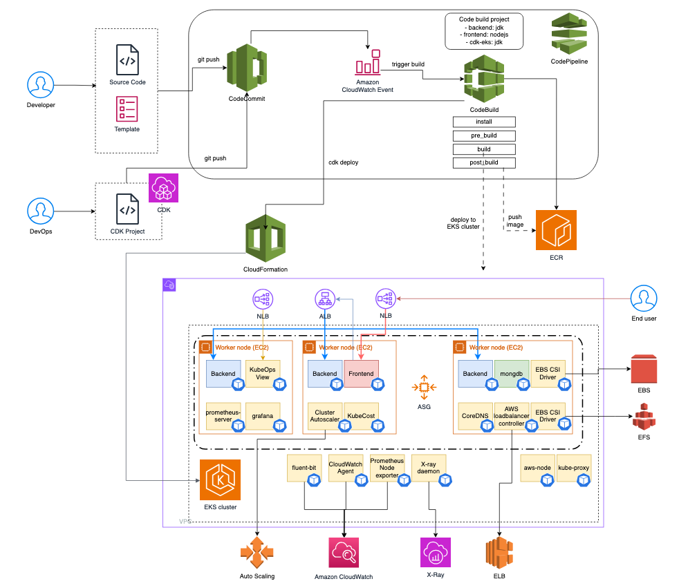
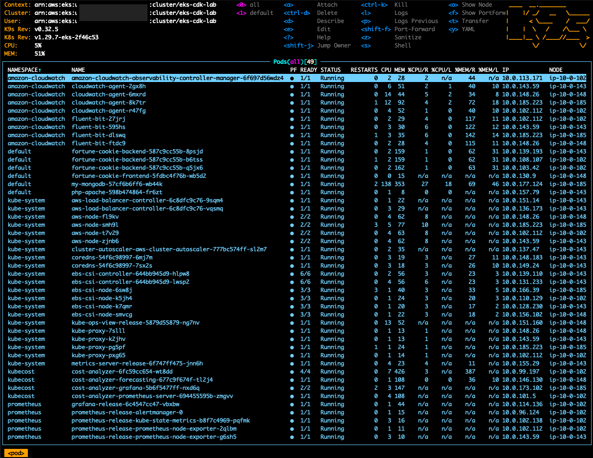
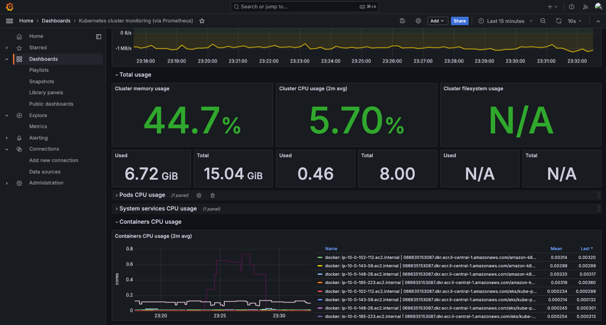
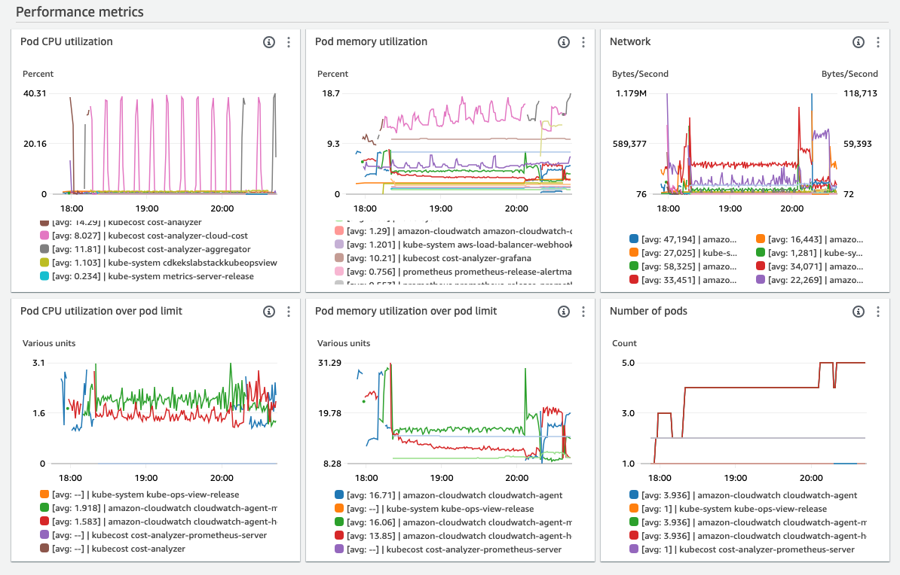
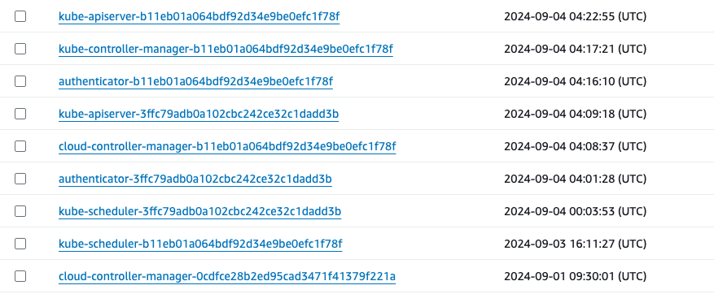
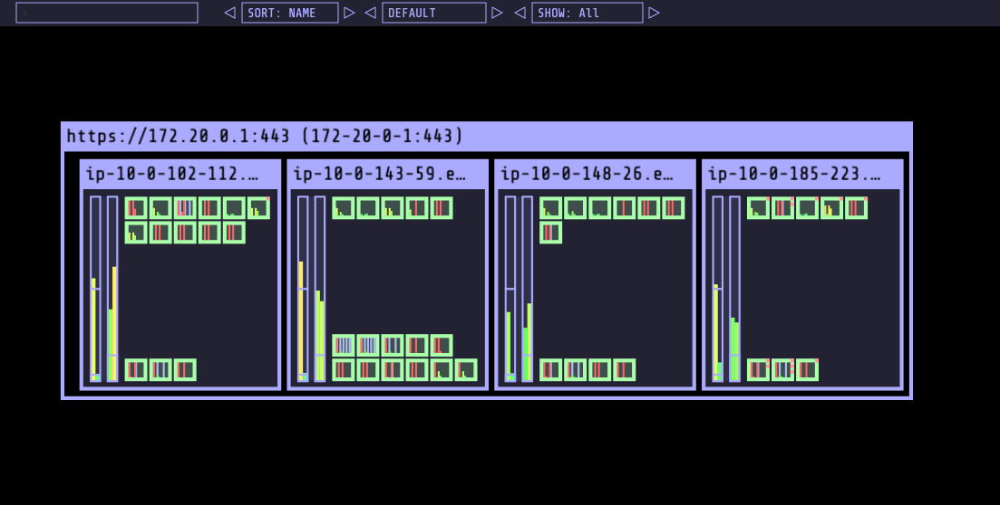
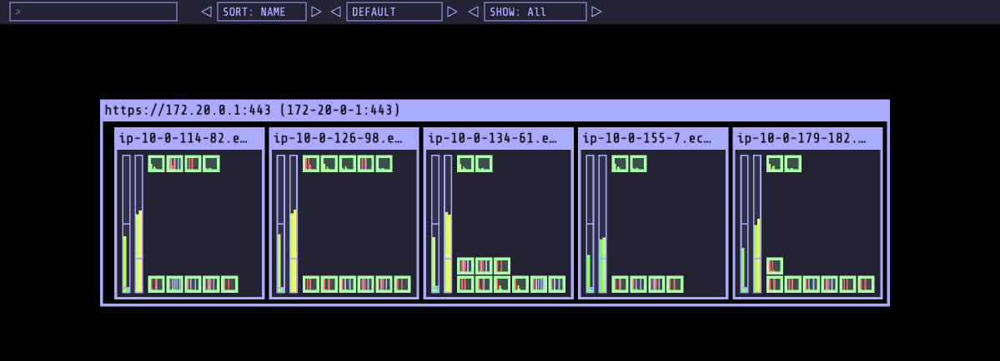
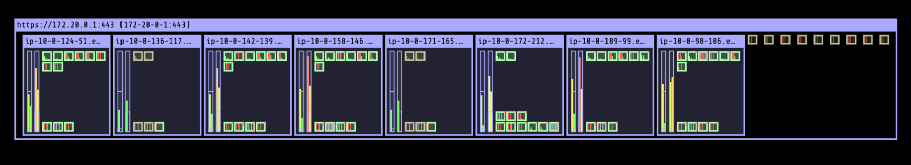

## EKS Management Project (CDK in Java) 

### Project Architecture Overview

This project outlines the architecture of our automated deployment and monitoring system using AWS services and 3rd party solutions. The setup is designed to efficiently manage infrastructure, deploy applications, and provide comprehensive monitoring and scaling capabilities.
This project includes:
- [CDK v2 Java Project for EKS cluster](./cdk-eks)
- [Fortune Cookie Backend application (Spring Boot/Java)](./fortune-cookie-backend)
- [Fortune Cookie Frontend application (ReactJS)](./fortune-cookie-frontend)



### 1. Infrastructure Provisioning

* AWS CDK: I utilized AWS Cloud Development Kit (CDK) v2 with Java to define and provisioned the infrastructure. The EKS cluster was fully bootstrapped with operational software that is needed to deploy and operate workloads.
  This includes:
    * A new Well-Architected VPC with both Public and Private subnets.
    * **Amazon EKS Cluster**: A managed Kubernetes service that hosts our applications.
    * **Managed Node Groups**: EC2 instances that serve as worker nodes for running applications and services.
    * **Cluster Management**:
        * [Cluster Autoscaler](https://github.com/kubernetes/autoscaler/tree/master/cluster-autoscaler), [Karpenter](https://karpenter.sh/) for dynamic node scaling, automatically adjusts the size of a Kubernetes Cluster so that all pods have a place to run.
        * KubeCost for cost management.
        * AWS Load Balancer Controller for exposing services/ingresses.      
    * **System Add-Ons**
        * VPC CNI Plugin
        * Kube-proxy
        * CoreDNS
        * EBS CSI Driver/ EFS CSI Driver
        * Kubernetes Metrics server
    * **Monitoring/Logging Tools**:
        * Prometheus and Grafana for metrics.
        * CloudWatch Agent and Fluent-bit for logging.



### 2. CI/CD Pipeline

* Source Code Management:
    * Developers push code to CodeCommit, which acts as the central repository.
    * DevOps Engineers use AWS CDK to define infrastructure as code, pushing updates to CodeCommit as well.
* CI/CD Pipeline:
    * CodePipeline automates the build and deployment process.
    * CodeBuild compiles and tests the backend (Java/Spring Boot) and frontend (React) applications, along with infrastructure changes.
    * Docker images are built and pushed to Elastic Container Registry (ECR).


### 3. Application Deployment

* Backend and Frontend Applications:
    * Backend (Spring Boot) and Frontend (React) applications are deployed on the EKS cluster through Kubernetes manifest files.
    * Backend application connects to MongoDB to store data.
    * Elastic Load Balancers (ALB and NLB): Manage incoming traffic and route it to the appropriate services.


### 4. Persistent Storage

* EBS and EFS CSI Drivers in EKS cluster: Enable persistent storage solutions for applications, using Elastic Block Store (EBS) and Elastic File System (EFS).


### 5. Monitoring and Logging

* Prometheus and Grafana: Collect and visualize metrics from the cluster.
  

* CloudWatch Container Insights: Provides detailed monitoring and logging.
    * CloudWatch agent
    * Fluent-bit: Processes and forwards logs to CloudWatch.

    

* X-Ray: Traces requests through applications to identify performance bottlenecks.
* EKS Control plane logging: collects the control plane logs of EKS (kube-api-server, kube-scheduler, audit log, etc)

  
* Kube Ops View: monitors the workloads placement in the kubernetes cluster
  


### 6. Auto Scaling and Cost Management

* Cluster Autoscaler: Automatically adjusts the size of a Kubernetes Cluster so that all pods have a place to run and there are no unneeded nodes.
* [KubeCost](https://www.kubecost.com/): Provides insights into Kubernetes resource costs and utilization.


### 7. Networking

* Virtual Private Cloud (VPC): Ensures secure networking for our EKS cluster and its components.
* AWS Load Balancer Controller: Provisions the load balancer and required resources within the cluster.
* VPC CNI Plugin: Supports native VPC networking for Amazon EKS.
* Kube proxy: Maintains network rules on each Amazon EC2 node.
* [CoreDNS](https://coredns.io/): CoreDns is a flexible, extensible DNS server that can serve as the Kubernetes cluster DNS.


### 8. Security

* Using OpenID Connect (OIDC) and IAM Roles for Service Accounts (IRSA) in Amazon EKS enhances security by providing fine-grained access control and reducing the need for static credentials.
    * Least Privilege Access: IRSA allows you to assign IAM roles directly to Kubernetes service accounts. This means each application or service can have permissions tailored specifically to its needs, adhering to the principle of least privilege.
    * Credential Isolation: Each pod only has access to the credentials associated with its service account, preventing unauthorized access to other resources.
    * Auditability: All access and actions are logged in AWS CloudTrail, providing a clear audit trail for security reviews.


### 9. HPA Configuration and Stress Testing

#### Testing Procedure

The objective of this test was to evaluate the scalability and performance of the backend application deployed on the Amazon EKS cluster. I aimed to ensure that the infrastructure could handle increased load efficiently using the Horizontal Pod Autoscaler (HPA) and Cluster Autoscaler.

1) HPA Setup:

* The Horizontal Pod Autoscaler is configured to monitor specific metrics, such as CPU or memory usage, for the backend application running on the EKS cluster. The HPA automatically adjusts the number of pods in response to these metrics.


```yaml
apiVersion: autoscaling/v2
kind: HorizontalPodAutoscaler
metadata:
  name: hpa-backend
  namespace: default
spec:
  scaleTargetRef:
    apiVersion: apps/v1
    kind: Deployment
    name: fortune-cookie-backend
  minReplicas: 3
  maxReplicas: 20
  metrics:
  - type: Resource
    resource:
      name: cpu
      target:
        type: Utilization
        averageUtilization: 50
```
2) Ingress and ALB:

* An Application Load Balancer (ALB) is set up to handle incoming traffic and route it to the backend application. The ALB provides a single entry point for requests, ensuring they are distributed across available pods.

3) Stress Testing:

* To test the scaling capabilities, continuous API requests are sent to the backend application via the ALB URL, specifically targeting the /fortunes/random endpoint. This simulates high traffic conditions.

4) Monitoring:

* Metrics were collected using Prometheus and visualized in Grafana to monitor resource utilization and scaling events.
* Logs and traces were captured using CloudWatch and X-Ray for detailed analysis.




#### Result

During the stress test, I could observe the backend application scaling efficiently. Initially, the number of pods increases, followed by a gradual scaling of nodes to support the additional pods.

*  Pod Scaling:
    * The HPA successfully scaled the number of pods in response to increased CPU usage, ensuring the application maintained performance levels.
* Node Scaling:
    * As the number of pods increased, the Cluster Autoscaler provisioned additional EC2 instances to accommodate the load, demonstrating effective resource management.
* Performance:
    * The application handled the stress test efficiently, with no significant performance degradation observed.
    * The system scaled seamlessly, maintaining availability and responsiveness.




This architecture ensures a robust, scalable, and automated environment for deploying and managing applications, with a strong focus on monitoring, cost management, and security. This document provides a high-level overview, highlighting the key components and their roles within the architecture.
