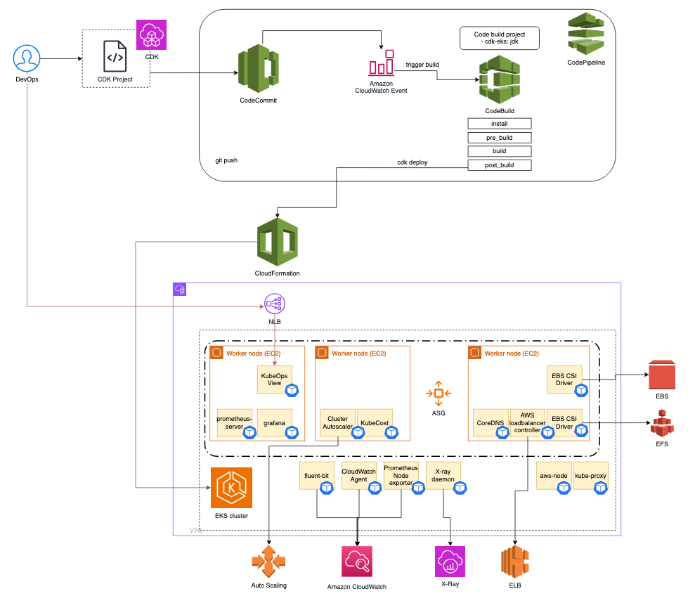

# EKS CDK Project in Java

This project is an AWS CDK (Cloud Development Kit) application designed to deploy an Amazon EKS (Elastic Kubernetes Service) cluster with various add-ons and configurations. The project uses Java as the programming language and leverages the AWS CDK to define infrastructure as code.



## Project Structure

- **CdkEksApp**: The entry point for the CDK application. It initializes the CDK app and deploys the EKS stack.
- **EksStack**: Defines the EKS cluster and its configuration, including add-ons and managed node groups.
- **EksManagedNodeGroupStack**: Defines a managed node group.
- **Add-ons**: Various classes that define additional components and services to be deployed in the EKS cluster, such as Prometheus, Grafana, and Cluster Autoscaler.

## Features

- Deploys an EKS cluster with configurable Kubernetes version and cluster name.
- Supports managed add-ons like VPC CNI, Kube Proxy, and CoreDNS.
- Integrates monitoring and logging tools such as Prometheus, Grafana, and CloudWatch.
- Implements scaling solutions like Cluster Autoscaler and Karpenter.
- Provides configuration flexibility via external properties files.

## Prerequisites

- **AWS Account**: An AWS account is required to deploy resources.
- **AWS CLI**: Ensure you have the AWS CLI installed and configured with the necessary permissions.
- **CDK CLI**: Install the AWS CDK CLI globally using npm:
  ```bash
  npm install -g aws-cdk

- Java: Ensure you have Java 11 or later installed.
- Maven: Apache Maven is required to build the project.

## Configuration
The project uses a configuration file (eks.properties) to manage various settings. Below are some key properties you can configure:
- eks.cluster.name: The name of the EKS cluster.
- eks.kubernetes.version: The Kubernetes version for the EKS cluster.
- eks.managed.addon.enabled: Enable or disable managed add-ons.
- aws.account.id: Your AWS account ID.
- aws.region.id: The AWS region where the resources will be deployed.

## Usage
1. Clone the Repository:
```bash
  git https://git-codecommit.us-east-1.amazonaws.com/v1/repos/cdk-eks cdk-eks
  cd cdk-eks
```  

2. Configure the Project:
- Update the eks.properties file with your desired configuration settings.

3. Build the Project:
- Use Maven to build the project:
```bash
mvn clean package
```

4. Deploy the CDK Stack:
- Use the AWS CDK CLI to deploy the stack:
```bash
cdk deploy --all
```

5. Destroy the CDK Stack:
- When you no longer need the resources, you can destroy the stack:
```bash
cdk destroy
```

## Additional Information
- Documentation: For more information on AWS CDK, refer to the AWS CDK Developer Guide.


## Useful commands for CDK

 * `mvn package`     compile and run tests
 * `cdk ls`          list all stacks in the app
 * `cdk synth`       emits the synthesized CloudFormation template
 * `cdk deploy`      deploy this stack to your default AWS account/region
 * `cdk deploy --all`      deploy all stacks in this project to your default AWS account/region
 * `cdk diff`        compare deployed stack with current state
 * `cdk docs`        open CDK documentation

Enjoy!
