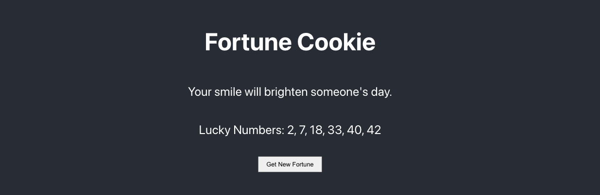
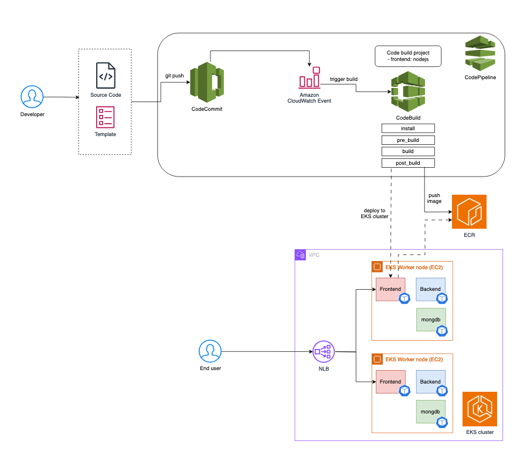
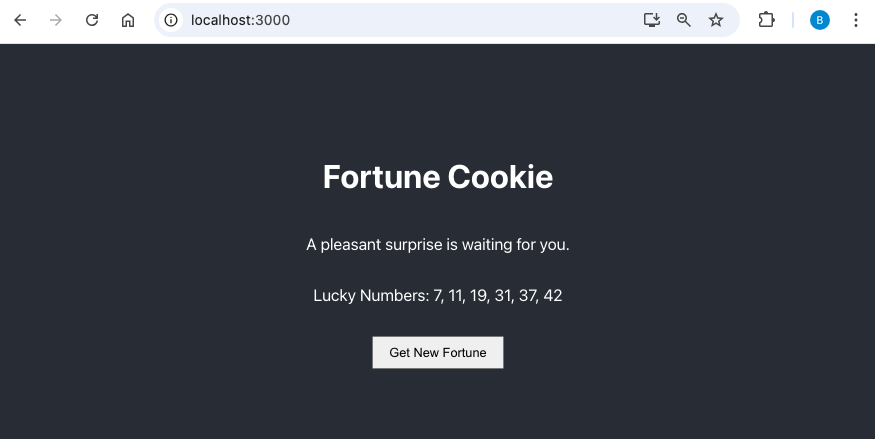

# Fortune Cookie React App


This is a simple React frontend application that fetches random fortune messages from a backend API. The application displays a fortune message and allows users to request a new fortune by clicking a button.


## Features

- Fetch and display random fortune messages from an API.
- Button to retrieve a new fortune message.
- Loading state indication when fetching a new fortune.

## Prerequisites

Before you begin, ensure you have met the following requirements:

- [Node.js](https://nodejs.org/) and npm installed on your machine.
- A running [Fortune-cookie backend API]() that provides fortune messages.

## Getting Started

To get a local copy up and running, follow these simple steps.

### Installation

1. **Clone the repository**:

   ```bash
   git clone https://github.com/your-username/fortune-cookie-react-app.git
   cd fortune-cookie-react-app
   
2. **Install dependencies**:

    ```bash
    npm install

3. **Set up environment variables**:
Create a .env file in the root directory and set the API URL:

    ```bash
    REACT_APP_API_URL=http://fortune-backend-api-url

### Running the Application
To start the development server, run:

```bash
npm start
```

This will run the app in development mode. Open http://localhost:3000 to view it in the browser.
The page will reload if you make edits. You will also see any lint errors in the console.

### Build, Deploy for Production




For production deployment, this project uses AWS CodeBuild and CodePipeline to automate the build and deployment process. The process is triggered by a push to the CodeCommit repository, which is detected by a CloudWatch event.

The `buildspec.yml` file is used to define the build process, which includes:

1. **Code Build**: The React application code is built using Node.js. This involves installing dependencies and creating a production build.

2. **Docker Build**: A Docker image is built from the production build of the React application. The Dockerfile specifies the base image and the steps to create the final image. By including `entrypoint.sh`, the app can read the Environment variables `REACT_APP_API_URL` which can be set during `docker run`.

3. **Push to ECR**: The Docker image is pushed to Amazon Elastic Container Registry (ECR), which is a fully-managed Docker container registry that makes it easy to store, manage, and deploy Docker container images.

4. **Deploy to Kubernetes**: The application will be deployed to EKS cluster, where a `Yaml` file specifies the desired state of the application, including the Docker image to use, the number of replicas, and other configurations. The deployment is applied to an Amazon EKS cluster.

#### Automation Workflow

1. **Push to CodeCommit**: By setting the CodeCommit repository and branch as a source in the CodePipeline pipeline, it starts the pipeline when a new commit is made on the configured CodeCommit repository and branch. CodePipeline creates a CodeCommit CloudWatch Events rule that starts your pipeline when a change occurs in the repository.

2. **CodeBuild Execution**: The CloudWatch Event starts a CodeBuild project, which executes the steps defined in the `buildspec.yml` file in the root directory.
   
3. **Docker Image Creation and Push**: During the `build`, CodeBuild builds the Docker image. And pushes it to ECR in the `post_build`.
   
4. **Kubernetes Deployment**: The new Docker image is deployed to the EKS cluster using the `/kubernetes/app/deployment-backend.yml` file. This ensures that the application is updated with the latest changes.

This automated workflow ensures that any changes to the code are quickly and reliably built, tested, and deployed to production, minimizing the need for manual intervention and reducing the risk of errors.

For more details on setting up AWS CodePipeline, CodeBuild, and EKS, please refer to the [AWS documentation](https://docs.aws.amazon.com/).


### Usage
- Open the application in your browser.
- 
- Click the "Get New Fortune" button to fetch and display a random fortune message.
- The button will show "Loading..." while fetching a new message.


### Learn more about Available Scripts

In the project directory, you can run:

### `npm start`

Runs the app in the development mode.\
Open [http://localhost:3000](http://localhost:3000) to view it in your browser.

The page will reload when you make changes.\
You may also see any lint errors in the console.

### `npm test`

Launches the test runner in the interactive watch mode.\
See the section about [running tests](https://facebook.github.io/create-react-app/docs/running-tests) for more information.

### `npm run build`

Builds the app for production to the `build` folder.\
It correctly bundles React in production mode and optimizes the build for the best performance.

The build is minified and the filenames include the hashes.\
Your app is ready to be deployed!

See the section about [deployment](https://facebook.github.io/create-react-app/docs/deployment) for more information.

### `npm run eject`

**Note: this is a one-way operation. Once you `eject`, you can't go back!**

If you aren't satisfied with the build tool and configuration choices, you can `eject` at any time. This command will remove the single build dependency from your project.

Instead, it will copy all the configuration files and the transitive dependencies (webpack, Babel, ESLint, etc) right into your project so you have full control over them. All of the commands except `eject` will still work, but they will point to the copied scripts so you can tweak them. At this point you're on your own.

You don't have to ever use `eject`. The curated feature set is suitable for small and middle deployments, and you shouldn't feel obligated to use this feature. However we understand that this tool wouldn't be useful if you couldn't customize it when you are ready for it.
